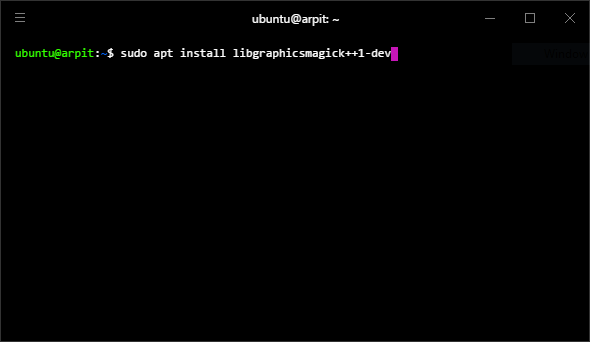
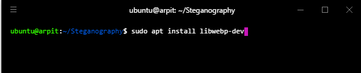
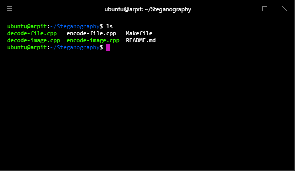
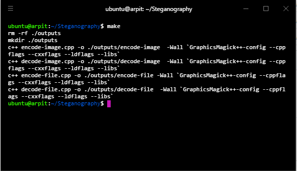
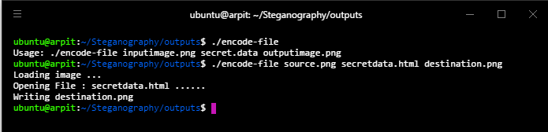
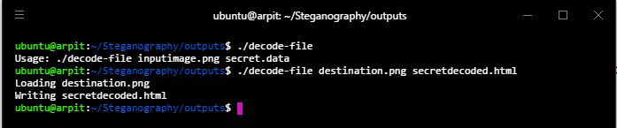
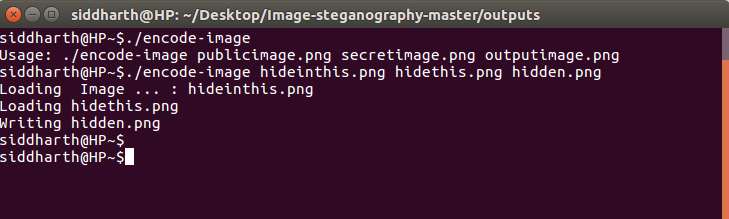
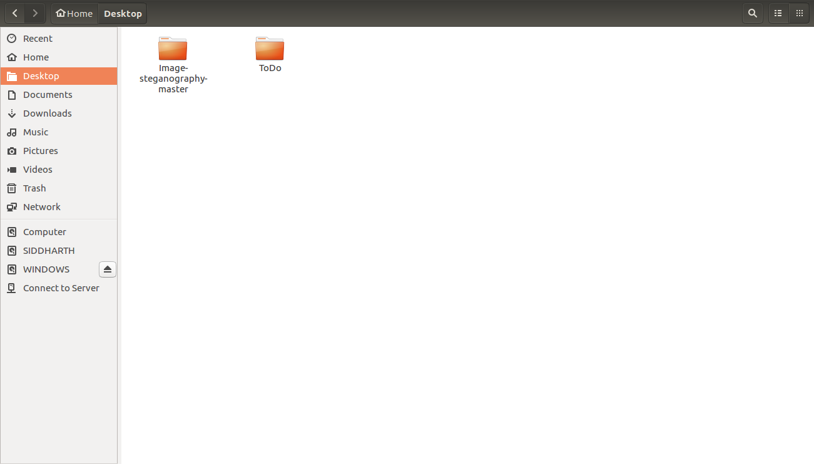
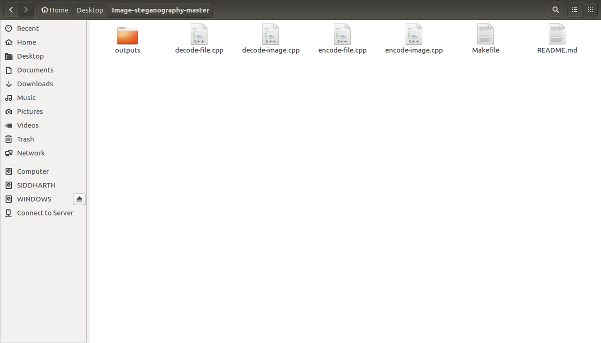
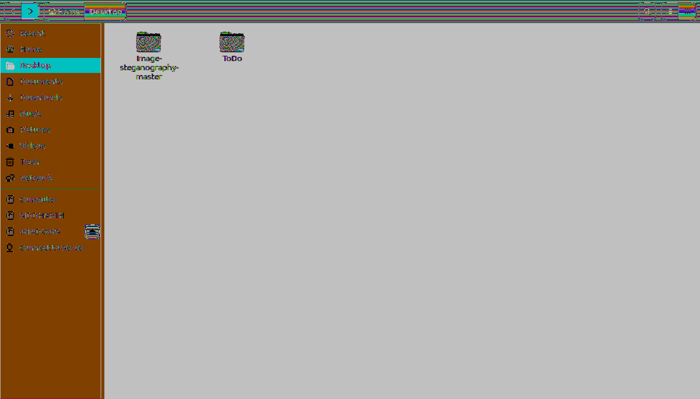

# LSB Image Steganography

In this technique, the existence of hidden secret data is concealed inside the least significant bits of pixel values of the cover object, as a result the notion of presence of secret information does not even exist.

## Attribution

This project is a re-implementation of [Christopher League's stegano repository](https://github.com/league/stegano), with additional features for file steganography and metadata handling.

## Prerequisites

Building them requires a C++ compiler and the GraphicsMagick library.

Installation of GraphicsMagick (to use Magick++ API):

On an Ubuntu system, you can install GraphicsMagick by issuing the following command:

`sudo apt install libgraphicsmagick++1-dev`

You will also need to install make and libwebp, which is a GraphicsMagick dependency.

## Building

Navigate to the directory containing the project. After that, verify that the files exist by typing `ls` and then typing `make` at the command prompt.

## Running

On successful compilation, the following files will be in the `outputs` folder:

**Note:** Use PNG images only. JPEG files use lossy compression and are therefore not supported.

### 1. encode-file

Encodes the secret data into the two low-order bits of the source holder image, producing the output image (encoded). If the secret data is too large, then only a part of the message will be encoded and a warning is displayed.

### 2. decode-file

Extracts the encoded data out of the two low-order bits of each color, producing the secret data file.

**Note:** While encoding the data, the number of lines of the secret data is stored in an external file (`lines.txt`) and the appropriate number of lines of the secret data is decoded so that there is no garbage data in the output file.
 

### 3. encode-image

Embeds the secret (private) image within the public (source holder) image, using 6 bits per color from public, and 2 bits per channel from private image, and produces an output (encoded image).

**Image that was hidden:**

**Image that was hidden upon:**

### 4. decode-image

Extracts the lowest two bits per channel from the input image, to form the source holder image.

**Note:** Loss of quality of the secret data occurs since we are holding the data in 2 bits.

**Decoded Image:**

